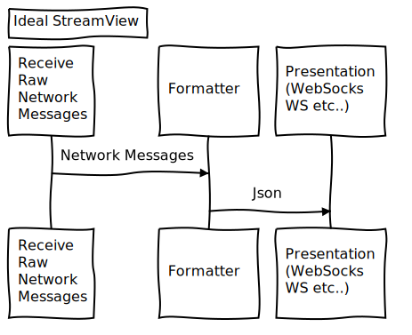

# streamview
Convert UDP Streams to Configurable HTTP Presentations

:construction: :warning:	 :construction: :warning: Development/Prototyping phase.

# Build:
  make deps
  
  make

# Example Usage:
./streamview 7778 8080

# Connect via netcat

nc -l -u localhost 7778

# TODO

* Stats
* Configurable UDP Package Serializations

