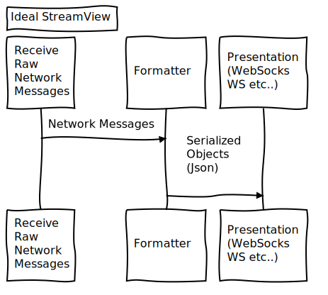

# streamview
Convert UDP Streams to Configurable HTTP Presentation

:construction: :warning:	 Expect dragons.

# Installation:

```bash
go get github.com/gorilla/websocket
go get github.com/yetkinozturk/streamview
```

# Usage:

```golang
package main

import (
	"flag"
	"fmt"
	"log"
	"os"

	sv "github.com/yetkinozturk/streamview"
)

func main() {

	flag.Parse()
	log.SetFlags(0)

	if len(os.Args) != 3 {
		fmt.Println("Usage: ./streamview udpport httpport")
		return
	}

	app := sv.NewStreamView(os.Args[1],os.Args[2])
	log.Fatal(app.Start())

}
```

# Tests/Example Usage:

examples/main.go

tests/push100K.go

# Usage via netcat

nc -u localhost 7778

# TODO

* Stats
* Configurable UDP Package Serializations



# Motivation

Almost every device supports UDP.  Implementing complex protocols on devices is extremely expensive and difficult.  With this kind of function as a service approach, external presentation layer can be used by this devices. 

# Use cases
* Displaying sensor data on web or mobile devices.
* Displaying realtime data on web pages.

